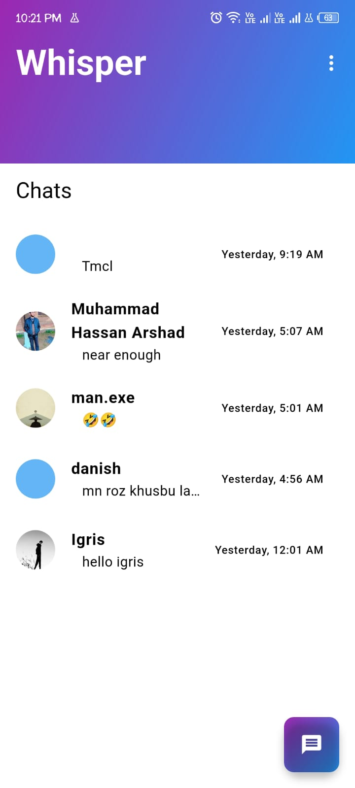
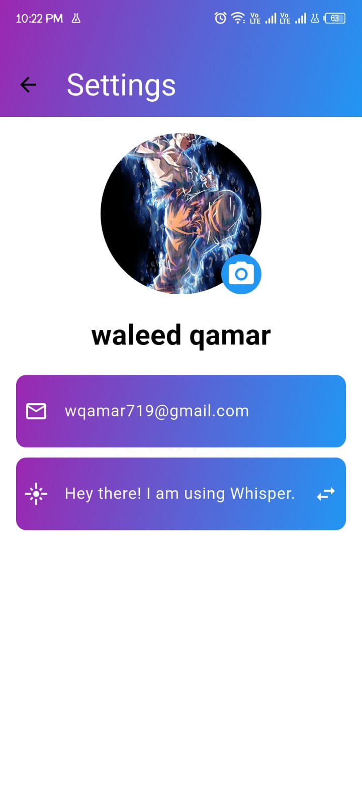
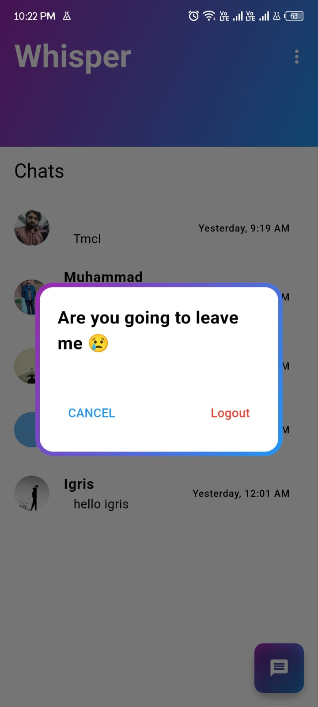

# Whisper - A Flutter Chat App

Whisper is a real-time chat application built using Flutter and Firebase, providing seamless communication with features like instant messaging, push notifications, and a clean UI.
Unlike traditional chat apps which require phone number whisper let you communicate with others using emails. You only need email to create a new account and start communicationg. 

## Features
- Real-time messaging
- Firebase authentication
- Push notifications
- User-friendly UI

## Screenshots

### Home Screen


### Chat Screen


### Profile Screen


### Log Out Pop Up


## Installation
1. Clone the repository:
   ```bash
   git clone your-repo-url
   ```
2. Navigate into the project directory:
   ```bash
   cd whisper
   ```
3. Install dependencies:
   ```bash
   flutter pub get
   ```
4. Run the app:
   ```bash
   flutter run
   ```

## Download
[Click here to download the app](https://drive.google.com/file/d/1LrOmsqKxQYQ3HEao-hSVT9RypfMMzYRS/view?usp=sharing)

## Contributions
Feel free to fork the repository and submit pull requests!

## License
This project is licensed under the MIT License.

